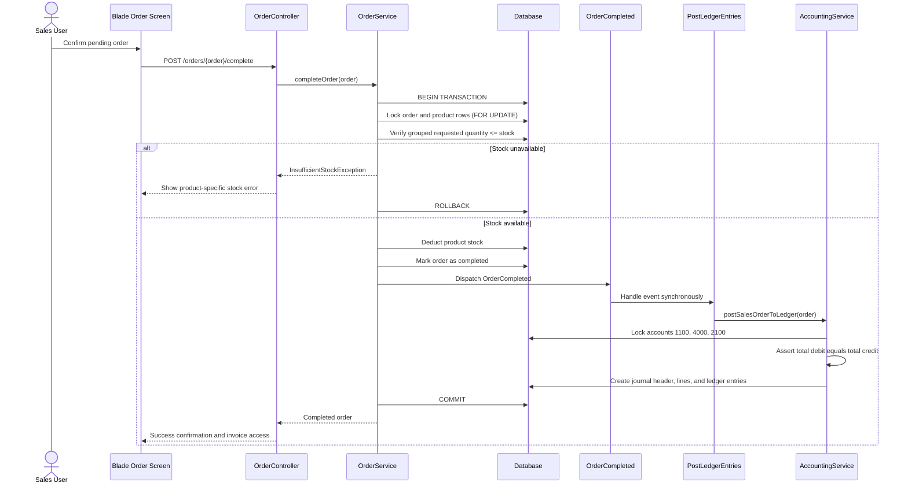
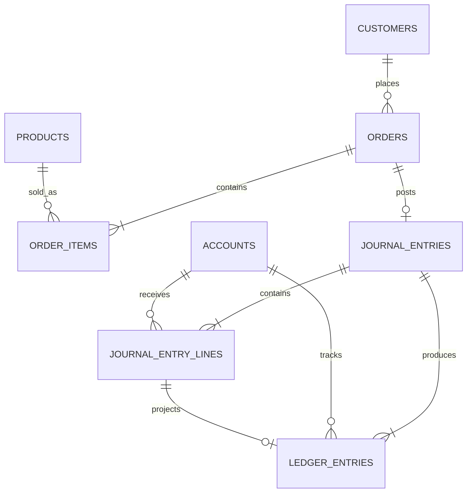

# Enterprise Mini POS & Double-Entry Invoicing System

A production-minded Laravel POS application that manages sales orders, inventory, printable invoices, and double-entry accounting in one cohesive workflow. It demonstrates financial-system essentials: deterministic money calculations, transactional integrity, concurrency control, audit-friendly journals, and a clean service-oriented architecture.

## Technology Stack

- **Backend:** Laravel 13, PHP 8.3+
- **Frontend:** Blade components, Tailwind CSS 4, Vite, and lightweight vanilla JavaScript (Alpine.js-compatible)
- **Database:** MySQL 8+ by default; PostgreSQL-compatible relational schema
- **Quality:** PHPUnit and Laravel Pint

## System Architecture Overview

The application separates HTTP concerns, order workflow rules, pricing, and accounting responsibilities.

- **Blade and Tailwind CSS UI** provides responsive order entry, invoices, and accounting views. Lightweight browser-side interactions provide immediate feedback; Laravel remains the source of truth.
- **Form Requests** validate request payloads before application services execute.
- **OrderService** owns order lifecycle transitions, inventory locking, stock verification, and atomic completion.
- **OrderCompleted and PostLedgerEntries** decouple accounting from order processing while executing synchronously inside the completion transaction.
- **AccountingService** produces balanced journal entries and account-ledger running balances.
- **Eloquent models and relational constraints** preserve traceability from customer and order through journal lines and ledger entries.

### High-level Features

- Customer and product master data, including SKU, price, and stock quantity
- Dynamic sales-order entry with product price snapshots and real-time indicative totals
- Server-side pricing: subtotal, fixed discount, 5% tax, and grand total calculated in integer cents
- Stock validation that aggregates duplicate product lines before checking availability
- Pessimistic product locking during completion to prevent overselling under concurrent requests
- Idempotent order completion: a completed order cannot post inventory or accounting twice
- Printable invoices available for completed orders
- Double-entry journal postings and per-account running balances
- Accounting dashboard with sales, receivables, tax payable, account balances, and recent journals

## Order Completion and Ledger Posting Flow



## Quick Installation & Setup

### Requirements

- PHP 8.3+
- Composer 2+
- Node.js 20+ and npm
- MySQL 8+ (default configuration) or PostgreSQL 14+

### Installation

```bash
git clone <your-github-repository-url>
cd alo-it-task

composer install
npm install

cp .env.example .env
php artisan key:generate
```

Create an empty database, then configure its credentials in `.env`.

```env
DB_CONNECTION=mysql
DB_HOST=127.0.0.1
DB_PORT=3306
DB_DATABASE=alo_pos
DB_USERNAME=root
DB_PASSWORD=
```

Run the schema and seed the chart of accounts, customers, and products:

```bash
php artisan migrate --seed
npm run build
php artisan serve
```

For active frontend development, use the Vite development server in a separate terminal:

```bash
npm run dev
```

To recreate local development data from scratch:

```bash
php artisan migrate:fresh --seed
```

## Database & Accounting Schema

The schema follows a journal-first accounting design: `journal_entries` is the immutable transaction header, `journal_entry_lines` contains individual debit/credit postings, and `ledger_entries` materializes each account's running balance for efficient reporting.



| Table | Responsibility | Key controls |
| --- | --- | --- |
| `accounts` | Chart of accounts with code, name, and account type | Unique account code; indexed type |
| `journal_entries` | One accounting transaction per completed order | Unique `order_id` and reference; dated audit header |
| `journal_entry_lines` | Debit and credit postings per journal | Foreign keys to journal and account; `decimal(12,2)` money fields |
| `ledger_entries` | Account-level transaction history and running balance | One row per journal line; indexed by account and journal |

### Sales Posting Policy

For a sales order with subtotal **1,000.00**, discount **100.00**, and 5% tax:

```text
Taxable amount = 1,000.00 - 100.00 = 900.00
Tax            = 900.00 × 5% = 45.00
Grand total    = 945.00
```

| Account | Debit | Credit |
| --- | ---: | ---: |
| 1100 — Accounts Receivable (Asset) | 945.00 | 0.00 |
| 4000 — Sales Revenue (Revenue) | 0.00 | 900.00 |
| 2100 — Tax Payable (Liability) | 0.00 | 45.00 |
| **Total** | **945.00** | **945.00** |

The service converts amounts to integer cents before comparison and throws when debits and credits differ. Assets and expenses use debit-normal balances; liabilities, equity, and revenue use credit-normal balances. This preserves the accounting equation: **Assets = Liabilities + Equity**.

## Testing & Code Quality

The feature suite covers the financially sensitive paths:

- Order creation validation and server-side total calculation
- Duplicate product-line stock aggregation
- Successful completion: stock deduction, journal creation, and balanced totals
- Insufficient-stock rollback with no partial inventory or ledger mutation
- Protection against duplicate completion and duplicate journal posting

Run the suite with:

```bash
php artisan test --compact
```

Code is formatted with Laravel Pint:

```bash
vendor/bin/pint --dirty --format agent
```

The project uses PHPUnit. Its test structure is compatible with a future Pest migration if the team standardizes on Pest.

## Project Structure

```text
app/
├── Enums/                 # Domain enums, including order status
├── Events/                # Order completion domain event
├── Exceptions/            # Stock and journal domain failures
├── Http/
│   ├── Controllers/       # Thin request/response orchestration
│   └── Requests/          # Form Request validation
├── Listeners/             # Event-driven ledger posting
├── Models/                # Eloquent relationships and casts
└── Services/              # Pricing, order workflow, and accounting services

database/
├── migrations/            # Relational schema, foreign keys, and indexes
└── seeders/               # Chart of accounts, customers, and products

resources/views/
├── accounting/            # Dashboard and account-ledger views
├── invoices/              # Print-ready invoices
└── orders/                # Order list, form, and details
```

## UI Screenshots

> Add final product screenshots to `docs/screenshots/` before submission.

### Order Form


### Printable Invoice


### Accounting Dashboard


## License

This project was created as a technical assessment and is intended for demonstration purposes.
