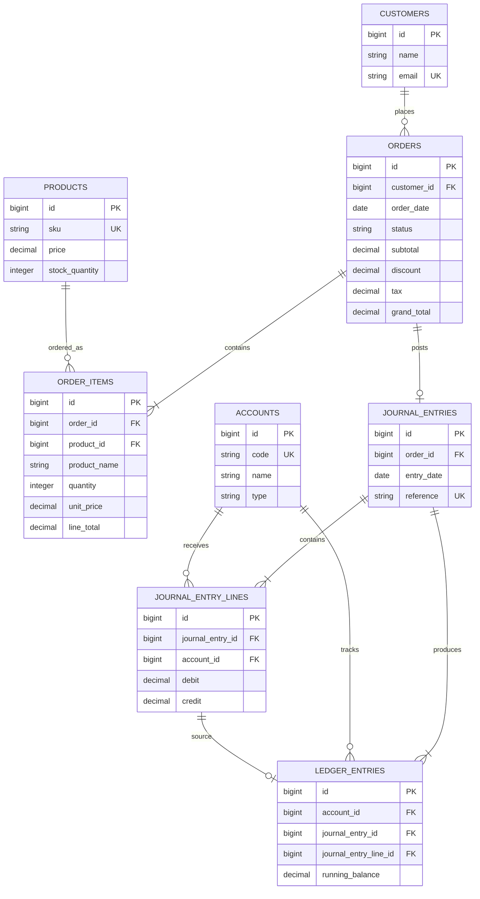

# ALO POS — Sales Orders, Invoices & Basic Accounting

A standalone Mini POS / Sales Order and Invoicing System built as a Junior Software Developer assessment for ALO IT Consultants.

The application creates pending sales orders, safely completes them against available stock, generates printable invoices, and records each completed sale using double-entry accounting.

## Features

- Customer and product master data with seeded sample records
- Dynamic order form with stock hints and real-time client-side totals
- Server-side validation and recalculation of all prices and totals
- Stock validation that aggregates duplicate products in an order
- Transactional order completion with product row locks
- Printable completed-order invoices
- Double-entry journal entries and account-ledger running balances
- Accounting dashboard for sales, receivables, tax payable, orders, and account movements
- Feature tests covering order creation, completion, stock failures, journal balancing, and idempotency

## Tech stack

- PHP 8.3+
- Laravel 13
- MySQL 8+
- Blade templates
- Tailwind CSS 4 with Vite
- Vanilla JavaScript
- PHPUnit

## Data model



## Accounting logic

All monetary values use `decimal(12,2)`. The pricing calculator uses integer cents internally to prevent floating-point drift.

For an order with a subtotal of ৳1,000.00 and a ৳100.00 discount:

```text
Taxable amount = 1,000.00 − 100.00 = 900.00
Tax (5%)       = 45.00
Grand total    = 945.00
```

When that order is completed, one balanced journal entry is created:

| Account | Debit | Credit |
| --- | ---: | ---: |
| 1100 Accounts Receivable | ৳945.00 | ৳0.00 |
| 4000 Sales Revenue | ৳0.00 | ৳900.00 |
| 2100 Tax Payable | ৳0.00 | ৳45.00 |
| **Total** | **৳945.00** | **৳945.00** |

Assets and expenses are debit-normal; liabilities, equity, and revenue are credit-normal. Each journal line creates one ledger entry with a persisted running balance.

## Installation

### Prerequisites

- PHP 8.3 or newer with `pdo_mysql`
- Composer 2
- Node.js 20+ and npm
- MySQL 8+

### Setup

```bash
git clone <your-github-repository-url>
cd alo-it-task

composer install
npm install

cp .env.example .env
php artisan key:generate
```

Create a MySQL database named `alo_pos`, then update `.env` if your database credentials differ:

```env
DB_CONNECTION=mysql
DB_HOST=127.0.0.1
DB_PORT=3306
DB_DATABASE=alo_pos
DB_USERNAME=root
DB_PASSWORD=
```

Run migrations, seed the sample data, and build frontend assets:

```bash
php artisan migrate --seed
npm run build
php artisan serve
```

For local frontend development, run this in a separate terminal instead of `npm run build`:

```bash
npm run dev
```

Open `http://localhost:8000`.

## Seeded data

- 4 chart-of-account records: Cash, Accounts Receivable, Tax Payable, and Sales Revenue
- 10 customers
- 15 products
- Deliberately low-stock products for testing completion failures

## Tests

```bash
php artisan test --compact
```

The default PHPUnit configuration uses an in-memory SQLite database. Ensure PHP has the `pdo_sqlite` extension enabled before running the feature suite. The production application uses MySQL.

## Project structure

```text
app/
├── Enums/                 # OrderStatus
├── Exceptions/            # Completion and accounting domain failures
├── Http/
│   ├── Controllers/       # Thin HTTP controllers
│   └── Requests/          # StoreOrderRequest validation
├── Models/                # Eloquent models and relationships
└── Services/              # Pricing, order workflow, accounting engine

database/
├── factories/             # Test data factories
├── migrations/            # Relational schema, constraints, and indexes
└── seeders/               # Chart of accounts, customers, products

resources/views/
├── accounting/            # Dashboard and per-account ledger
├── components/            # Shared layout and flash message
├── invoices/              # Printable invoice preview
└── orders/                # Order list, form, and details

tests/
├── Feature/               # End-to-end order workflow tests
└── Unit/                  # Pricing rounding test
```

## Screenshots

Add final submission screenshots in [`docs/screenshots`](docs/screenshots):

- `order-form.png`
- `invoice.png`
- `accounting-dashboard.png`

## Key business rules

- Orders begin as `pending`; stock is deducted only when completed.
- Discounts cannot exceed the subtotal.
- Tax is 5% of the discounted amount, rounded to two decimal places.
- Browser totals are informational only; the server recalculates all stored totals.
- Completion locks products, validates stock, deducts stock, posts accounting records, and marks the order completed in one transaction.
- Completed orders cannot be completed again.
